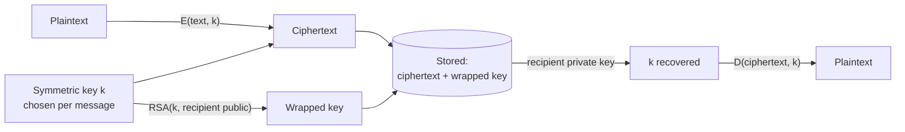

<div align="center">

# 🔐 Key Distribution Center

**A working model of hybrid encryption: classical ciphers for the message, RSA for the key.**

[](https://openjdk.org/)
[](https://spring.io/projects/spring-boot)
[](https://www.postgresql.org/)
[](https://www.docker.com/)

[Setup guide](docs/guide.md) · [Cipher engine](src/main/java/bee01/humbat/keydistributioncenter/cryptography)

</div>

---

## What this is

A Spring Boot application that implements the **key distribution problem** and one of its
answers, end to end: every account is issued an RSA key pair, a message is enciphered with a
symmetric key chosen per message, and that symmetric key is then wrapped with the recipient's
public key. The wrapped key travels with the ciphertext, so the two parties never need a shared
secret arranged in advance and the key is never stored in the clear.

**The symmetric ciphers are the classical ones** — Caesar, Vigenère, Playfair, Rail Fence — and
they are implemented from scratch rather than called from a library. That is the point of the
exercise: the *structure* around them is the real subject, and the structure is the same one
TLS uses. Swap the symmetric layer for AES and the envelope does not change.

> **Not for protecting anything real.** Every cipher here falls to frequency analysis, and a
> Caesar shift falls to twenty-five guesses. This is coursework about how key distribution
> works, not a secure messenger. The RSA envelope is genuine; what it wraps is not.

## How a message travels



Four properties follow from that shape, and they are what the project is demonstrating:

| | |
|---|---|
| **No pre-shared secret** | The sender needs only the recipient's *public* key |
| **The key is never stored bare** | Only its RSA-wrapped form reaches the database |
| **One key per message** | Compromising one key exposes one message |
| **Only the holder can read** | Unwrapping requires the private key, which never leaves its owner |

Open any message's **"what is actually stored"** panel in the app to see the ciphertext, the
wrapped key and the unwrapped key side by side.

## Ciphers

| Cipher | Kind | Key it needs | Block modes |
|---|---|---|---|
| **Caesar** | Substitution, fixed shift | a whole number | ✅ |
| **Vigenère** | Polyalphabetic substitution | any text | ✅ |
| **Playfair** | Digram substitution, 5×5 matrix | letters only | — |
| **Rail Fence** | Transposition | a whole number | — |
| **RSA** | Asymmetric | generated per account | — |

Block modes — **ECB**, **CBC**, **CFB**, **OFB** — apply to the two ciphers that work character
by character. Playfair and Rail Fence rearrange the whole text, so a block mode has nothing to
chain; the interface disables the control rather than accepting a setting it would ignore.

The key column is not decoration: `Key.giveKey` picks the key *type* from the algorithm, so a
Caesar cipher handed `MYSECRETKEY` rejects it. The forms state the requirement per cipher and
change the hint as you switch.

## Running it

Everything runs in containers — no JDK, Maven or PostgreSQL needed on the machine.

```bash
cp .env.example .env          # then set POSTGRES_PASSWORD
docker compose up --build
```

Then open <http://localhost:8080>. A username that does not exist yet is registered on first
sign-in, and its RSA key pair is generated there and then; open a second browser profile to
create a second account and send something between them.

```bash
docker compose logs -f app    # follow the application
docker compose down           # stop
docker compose down -v        # stop and discard the database
```

**Configuration** is entirely environment-driven. `SPRING_DATASOURCE_PASSWORD` has no default,
deliberately: the application refuses to start rather than quietly connecting as something
unintended. See [`application.properties`](src/main/resources/application.properties), where
every setting says what it is for.

## Layout

```
src/main/java/…/keydistributioncenter/
├── controllers/       HTTP entry points — auth, messages, cipher tools, errors
├── cryptography/
│   ├── ciphers/       the four classical ciphers and RSA, written out
│   ├── keys/          key types; giveKey() maps an algorithm to the key it accepts
│   ├── enums/         Algorithm, Mode
│   └── CryptEngine    runs a cipher through a block mode
├── entities/          User, Message, Session
├── filters/           SessionFilter — cookie to user, or a redirect to /auth
├── repositories/      Spring Data JPA
└── services/          user, session and message logic

src/main/resources/
├── templates/         Thymeleaf; shared chrome in fragments/layout.html
└── static/            app.css, app.js, auth.js
```

## Images and CI

[`.github/workflows/image.yml`](.github/workflows/image.yml) runs the test suite against a real
PostgreSQL, builds the container image, and before publishing anything it:

- asserts the image carries no `.env`, no key material, no sources, and does not run as root;
- checks the packaged `application.properties` contains no literal database password;
- starts the image against a live database and waits for its healthcheck, then confirms the
  sign-in page renders, a request without a session is turned away, and the health endpoint
  reports `UP` without leaking the datasource URL.

A push to `master` publishes `latest` and a `sha-` tag. **`prod` moves only when the workflow is
run manually with `release=true`** — because Hibernate applies the schema at start-up, so an
automatic deployment of every commit would also be an unreviewed schema change, and that is the
one step putting the old image back does not undo.

## Team

**Humbat Jamalov** · **Asim Gasimov** · **Yunis Kangarli**

<div align="center">
<sub>UFAZ — French-Azerbaijani University</sub>
</div>
