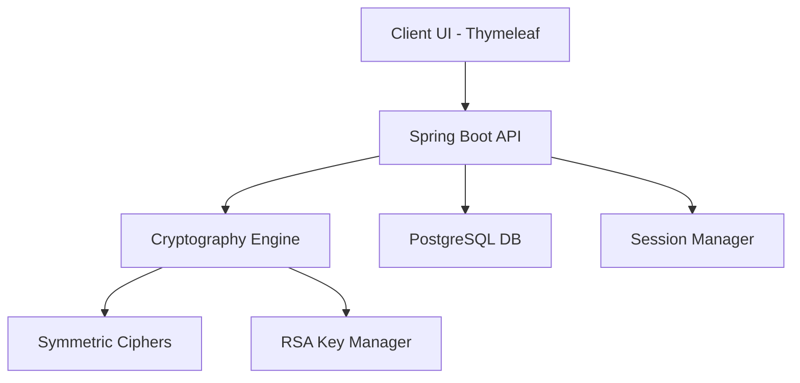

<div align="center">

# 🔐 WeCrypt
### Next-Generation Key Distribution & Secure Messaging System
[](https://www.oracle.com/java/)
[](https://spring.io/projects/spring-boot)
[](https://www.docker.com/)

---

**WeCrypt** is a sophisticated end-to-end encrypted messaging platform designed with a focus on cryptographic integrity and modern user experience. Built on a robust **Spring Boot** architecture, it implements a custom **Key Distribution Center (KDC)** logic and a variety of symmetric/asymmetric encryption standards.

[**Explore Documentation**](docs/guide.md) • [**Deploy to Render**](docs/guide.md#deployment-to-render)

</div>

## ✨ Core Features

- **🛡️ Custom Cryptography Engine**: In-depth implementation of classical and modern ciphers.
- **🔐 RSA Key Management**: Automatic asymmetric keypair generation for every user.
- **⛓️ Multiple Block Modes**: Support for ECB, CBC, CFB, and OFB operation modes.
- **📤 Secure Envelope Messaging**: Messages are encrypted with symmetric keys, which are then vaulted using RSA.
- **🎨 Premium UI**: Modern glassmorphism design with seamless Dark/Light mode transitions.
- **🚀 Cloud Native**: Fully Dockerized and optimized for high-performance deployment.

---

## 🧠 Cryptographic Blueprint

WeCrypt utilizes a multi-layered security approach:

### 1. Symmetric Algorithms
| Algorithm | Type | Description |
| :--- | :--- | :--- |
| **Caesar** | Substitution | Classic shift cipher with block mode support. |
| **Vigenère** | Polyalphabetic | Advanced polyalphabetic substitution. |
| **Playfair** | Digraph | Symmetric encryption using a 5x5 matrix. |
| **Rail Fence** | Transposition | Geometric transposition cipher. |

### 2. Block Cipher Modes
Enhance security by choosing how data blocks are processed:
- **ECB**: Electronic Codebook (Standard)
- **CBC**: Cipher Block Chaining (Recommended)
- **CFB**: Cipher Feedback
- **OFB**: Output Feedback

---

## 🛠️ Quick Start

### 🐳 Run with Docker (Recommended)
Launch the entire stack (App + PostgreSQL) instantly:
```bash
docker-compose up --build
```
Access the dashboard at: `http://localhost:8080`

### 💻 Local Development
1. Ensure you have **Java 17** and **Maven** installed.
2. Setup a PostgreSQL database named `kdc`.
3. Run the application:
```bash
./mvnw spring-boot:run
```

---

## 📁 Architecture Overview



## 👥 Development Team
- **Humbat Jamalov**
- **Asim Gasimov**
- **Yunis Kangarli**

---

<div align="center">
  <sub>Built with ❤️ at UFAZ (French-Azerbaijani University) - 2025</sub>
</div>
